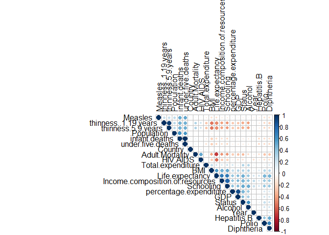
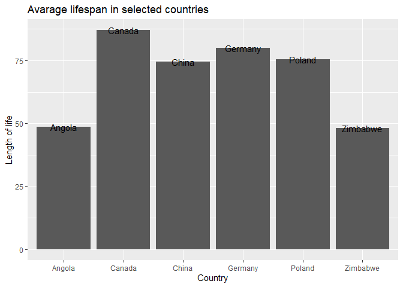

-   [Wnioski z analizy](#wnioski-z-analizy)
-   [Wykorzystane biblioteki](#wykorzystane-biblioteki)
-   [Wczytanie danych z pliku](#wczytanie-danych-z-pliku)
-   [Podsumowanie zbioru](#podsumowanie-zbioru)
-   [Przetwarzanie brakujących
    danych](#przetwarzanie-brakujacych-danych)
-   [Podział zbioru na uczący i
    testowy](#podzia-zbioru-na-uczacy-i-testowy)
-   [Analiza wartości atrybutów](#analiza-wartosci-atrybutow)
-   [Korelacja pomiędzy poszczególnymi
    atrybutami](#korelacja-pomiedzy-poszczegolnymi-atrybutami)
-   [Graficzna reprezentacja średniej długości wieku w zależności od
    roku i
    kraju](#graficzna-reprezentacja-sredniej-dugosci-wieku-w-zaleznosci-od-roku-i-kraju)
-   [Stworzyć model (regresor)](#stworzyc-model-regresor)
-   [Analiza atrybutów modelu](#analiza-atrybutow-modelu)
-   [Podsumowanie](#podsumowanie)

Wnioski z analizy
=================

Przeprowadzone badania pozwalają stwierdzić, które parametry mają
najwyższy wpływ na długość życia ludzi w poszczególnych krajach.

Parametrami najwidoczniej wpływającymi pozytywnie na długość życia
mieszkańców są przede wszystkim wskaźnik określający produktywność
zużywania zasobów oraz średnia liczba lat edukacji, zaś w nieco
mniejszym stopniu status kraju (rozwinięty / rozwijający się) oraz
szczepienie dzieci przeciwko odpowiednim chorobom (polio / błonica,
tężec i krztusiec).

Z kolei niski współczynnik średniej długości życia okazał się być
najwidoczniej skorelowany bezpośrednio z liczbą zgonów wśród dorosłych,
a także (w nieco mniejszym stopniu) śmiertelnością spowodowaną
zakażeniami HIV/AIDS i niedowagą ludzi w wieku 5-19 lat (a więc i
najpewniej z niedożywieniem / problemem głodu w danym kraju).

Najwyższy ogólny wpływ na średnią długość życia miały więc produktywność
zużywania zasobów, średnia liczba lat edukacji oraz śmiertelność wśród
dorosłych.

Wykorzystane biblioteki
=======================

W trakcie analizy danych wykorzystano następujące biblioteki:

    library(corrplot)
    library(e1071)
    library(caTools)
    library(dplyr)
    library(ggplot2)
    library(Metrics)

Wczytanie danych z pliku
========================

Wczytanie danych z pliku \*.csv odbywa się poprzez wykorzystanie
podstawowego polecenia:

    dataset = read.csv('Life_Expectancy_Data.csv')
    dataset <- as.data.frame(dataset)
    chart_dataset <- dataset

    knitr::kable(head(dataset,1), format="markdown")

<table>
<colgroup>
<col style="width: 4%" />
<col style="width: 1%" />
<col style="width: 3%" />
<col style="width: 5%" />
<col style="width: 5%" />
<col style="width: 4%" />
<col style="width: 2%" />
<col style="width: 7%" />
<col style="width: 4%" />
<col style="width: 2%" />
<col style="width: 1%" />
<col style="width: 6%" />
<col style="width: 2%" />
<col style="width: 6%" />
<col style="width: 3%" />
<col style="width: 3%" />
<col style="width: 3%" />
<col style="width: 3%" />
<col style="width: 7%" />
<col style="width: 6%" />
<col style="width: 10%" />
<col style="width: 3%" />
</colgroup>
<thead>
<tr class="header">
<th style="text-align: left;">Country</th>
<th style="text-align: right;">Year</th>
<th style="text-align: left;">Status</th>
<th style="text-align: right;">Life.expectancy</th>
<th style="text-align: right;">Adult.Mortality</th>
<th style="text-align: right;">infant.deaths</th>
<th style="text-align: right;">Alcohol</th>
<th style="text-align: right;">percentage.expenditure</th>
<th style="text-align: right;">Hepatitis.B</th>
<th style="text-align: right;">Measles</th>
<th style="text-align: right;">BMI</th>
<th style="text-align: right;">under.five.deaths</th>
<th style="text-align: right;">Polio</th>
<th style="text-align: right;">Total.expenditure</th>
<th style="text-align: right;">Diphtheria</th>
<th style="text-align: right;">HIV.AIDS</th>
<th style="text-align: right;">GDP</th>
<th style="text-align: right;">Population</th>
<th style="text-align: right;">thinness..1.19.years</th>
<th style="text-align: right;">thinness.5.9.years</th>
<th style="text-align: right;">Income.composition.of.resources</th>
<th style="text-align: right;">Schooling</th>
</tr>
</thead>
<tbody>
<tr class="odd">
<td style="text-align: left;">Afghanistan</td>
<td style="text-align: right;">2015</td>
<td style="text-align: left;">Developing</td>
<td style="text-align: right;">65</td>
<td style="text-align: right;">263</td>
<td style="text-align: right;">62</td>
<td style="text-align: right;">0.01</td>
<td style="text-align: right;">71.27962</td>
<td style="text-align: right;">65</td>
<td style="text-align: right;">1154</td>
<td style="text-align: right;">19.1</td>
<td style="text-align: right;">83</td>
<td style="text-align: right;">6</td>
<td style="text-align: right;">8.16</td>
<td style="text-align: right;">65</td>
<td style="text-align: right;">0.1</td>
<td style="text-align: right;">584.2592</td>
<td style="text-align: right;">33736494</td>
<td style="text-align: right;">17.2</td>
<td style="text-align: right;">17.3</td>
<td style="text-align: right;">0.479</td>
<td style="text-align: right;">10.1</td>
</tr>
</tbody>
</table>

Podsumowanie zbioru
===================

Zbiór danych zawiera:

    print(nrow(dataset))

    ## [1] 2938

    print(ncol(dataset))

    ## [1] 22

Zbiór danych skłąda sie z następujących atrybutóW:

-   Country: kraj,
-   Year: rok,
-   Status: status kraju: “Developing” dla krajów rozwijających się i
    “Developed” dla krajów rozwiniętych,
-   Life expectancy : oczekiwana długość życia w momencie urodzenia w
    danym kraju w danym roku,
-   Adult Mortality: liczba zgonów wśród dorosłych (liczba śmierci
    między 15 a 60 rokiem życia na 1000 mieszkańców)
-   infant deaths: liczba zgonów wśród dzieci na 1000 mieszkańców,
-   Alcohol: spożycie alkoholu (w litrach na mieszkańca powyżej 15
    r.ż.),
-   percentage expenditure: procent PKB przeznaczony na ochronę zdrowia,
-   Hepatitis B: procent dzieci 1-rocznych zaszczepionych przeciw WZW B,
-   Measles: liczba zgłoszonych przypadków odry na 1000 mieszkańców,
-   BMI: średnia wartość współczynnika BMI wśród populacji,
-   under-five deaths: liczba zgonów dzieci poniżej 5 r.ż na 1000
    mieszkańców,
-   Polio: procent 1-rocznych dzieci zaszczepionych przeciw Polio,
-   Total expenditure: procent rządowych wydatków na ochronę zdrowia w
    stosunku do wszystich wydatków w budżecie,
-   Diphtheria: procent dzieci 1-rocznych zaszczepionych na błonicę,
    tężec i krztusiec,
-   HIV/AIDS: liczba zgonów z powodu zakażenia HIV/AIDS wśród dzieci do
    4 r.ż na 1000 żywych urodzeń,
-   GDP: PKB na mieszkańca (w USD),
-   Population: liczba mieszkańców kraju,
-   thinness 10-19 years: procent osób w wieku 10-19 lat z niedowagą,
-   thinness 5-9 years: procent dzieci w wieku 5-9 lat z niedowagą,
-   Income composition of resources: Wskaźnik określający produktywność
    żużywania zasobów (0-1)
-   Schooling: średnia liczba lat edukacji.

Przetwarzanie brakujących danych
================================

Łatwo możemy zauważyć, że zbiór danych zawiera obserwacje z brakującymi
danymi. W takim wypadku można wykonać jedną z następujących operacji:

-   usunąć ze zbioru rekordy z pustymi atrybutami,
-   usunąć atrybuty zawierające puste wartości,
-   wygenerować wartości atrybutóW które są puste w celu uzupełnienia
    zbioru.

W przypadku naszego zbioru danych użyjemy funkcji uzupełniającej puste
pola średnią wartością danego atrybutu z obserwacji, które tą wartość
posiadają. Wykorzystanie pozostałych metod skutkowałoby utratą dużej
części informacji, na co w przypadku pracy na relatywnie małym zbiorze
danych nie możemy sobie pozwolić.

    encode_ordinal <- function(x, order = unique(x)) {
      x <- as.numeric(factor(x, levels = order, exclude = NULL))
      x
    }

    dataset[["Country"]] <- encode_ordinal(dataset[["Country"]])
    dataset[["Status"]] <- encode_ordinal(dataset[["Status"]])

    for(i in 1:ncol(dataset)){
      dataset[is.na(dataset[,i]), i] <- mean(dataset[,i], na.rm = TRUE)
    }

Podział zbioru na uczący i testowy
==================================

W celu poprawności przeprowadzanego procesu wykorzystujacego modeel
regresji przed jakimkolwiek podglądem dostępnych danych oraz ich
wartości należy podzielić zbiór danych na zbiór uczący i testowy. Zbiór
testowy zostannie wykorzystany dopiero przy sprawdzeniu trafności i
jakości stworoznego modelu. Dane zostaly podzielone w następujący
sposób: \* zbiór uczący - 75% \* zbiór testowy -25%

    set.seed(123)
    split = caTools::sample.split(dataset$Life.expectancy, SplitRatio = 3/4)
    training_set = subset(dataset, split == TRUE)
    test_set = subset(dataset, split == FALSE)

Analiza wartości atrybutów
==========================

Poniżej przedstawiono podstawowe dane o poszczególnych atrybutach
występujących w zbiorze danych:

    ##     Country            Year          Status      Life.expectancy
    ##  Min.   :  1.00   Min.   :2000   Min.   :1.000   Min.   :36.30  
    ##  1st Qu.: 47.00   1st Qu.:2004   1st Qu.:1.000   1st Qu.:63.00  
    ##  Median : 94.00   Median :2008   Median :1.000   Median :72.00  
    ##  Mean   : 95.94   Mean   :2008   Mean   :1.174   Mean   :69.14  
    ##  3rd Qu.:145.00   3rd Qu.:2012   3rd Qu.:1.000   3rd Qu.:75.60  
    ##  Max.   :193.00   Max.   :2015   Max.   :2.000   Max.   :89.00  
    ##  Adult.Mortality infant.deaths       Alcohol       percentage.expenditure
    ##  Min.   :  1.0   Min.   :   0.0   Min.   : 0.010   Min.   :    0.000     
    ##  1st Qu.: 74.0   1st Qu.:   0.0   1st Qu.: 1.020   1st Qu.:    4.721     
    ##  Median :144.0   Median :   3.0   Median : 4.090   Median :   64.737     
    ##  Mean   :166.1   Mean   :  30.1   Mean   : 4.549   Mean   :  744.973     
    ##  3rd Qu.:228.0   3rd Qu.:  22.0   3rd Qu.: 7.330   3rd Qu.:  442.377     
    ##  Max.   :723.0   Max.   :1800.0   Max.   :17.870   Max.   :19479.912     
    ##   Hepatitis.B       Measles            BMI        under.five.deaths
    ##  Min.   : 1.00   Min.   :     0   Min.   : 1.00   Min.   :   0.00  
    ##  1st Qu.:80.94   1st Qu.:     0   1st Qu.:19.00   1st Qu.:   0.00  
    ##  Median :86.00   Median :    15   Median :43.00   Median :   4.00  
    ##  Mean   :80.88   Mean   :  2362   Mean   :38.04   Mean   :  41.67  
    ##  3rd Qu.:96.00   3rd Qu.:   333   3rd Qu.:55.90   3rd Qu.:  28.00  
    ##  Max.   :99.00   Max.   :212183   Max.   :87.30   Max.   :2400.00  
    ##      Polio       Total.expenditure   Diphtheria       HIV.AIDS     
    ##  Min.   : 3.00   Min.   : 0.370    Min.   : 2.00   Min.   : 0.100  
    ##  1st Qu.:78.00   1st Qu.: 4.450    1st Qu.:78.00   1st Qu.: 0.100  
    ##  Median :93.00   Median : 5.938    Median :92.00   Median : 0.100  
    ##  Mean   :82.35   Mean   : 5.998    Mean   :82.15   Mean   : 1.784  
    ##  3rd Qu.:97.00   3rd Qu.: 7.430    3rd Qu.:97.00   3rd Qu.: 0.800  
    ##  Max.   :99.00   Max.   :17.600    Max.   :99.00   Max.   :50.600  
    ##       GDP              Population        thinness..1.19.years
    ##  Min.   :     1.68   Min.   :3.400e+01   Min.   : 0.100      
    ##  1st Qu.:   571.16   1st Qu.:3.986e+05   1st Qu.: 1.600      
    ##  Median :  3138.89   Median :3.637e+06   Median : 3.400      
    ##  Mean   :  7550.45   Mean   :1.280e+07   Mean   : 4.841      
    ##  3rd Qu.:  7483.16   3rd Qu.:1.275e+07   3rd Qu.: 7.200      
    ##  Max.   :119172.74   Max.   :1.294e+09   Max.   :27.500      
    ##  thinness.5.9.years Income.composition.of.resources   Schooling    
    ##  Min.   : 0.100     Min.   :0.0000                  Min.   : 0.00  
    ##  1st Qu.: 1.500     1st Qu.:0.5000                  1st Qu.:10.20  
    ##  Median : 3.400     Median :0.6600                  Median :12.10  
    ##  Mean   : 4.873     Mean   :0.6258                  Mean   :11.97  
    ##  3rd Qu.: 7.200     3rd Qu.:0.7710                  3rd Qu.:14.10  
    ##  Max.   :28.500     Max.   :0.9480                  Max.   :20.70

Jak widać w zbiorze danych mamy do czynienia z dwoma atrybutami … Na
powyższym podumowaniu, dla każdego atrybuty policzone następujace miary:

-   Min - wartość minimalna atrybutu,
-   1st Qu. - kwartyl dolny (rzędu 1/4),
-   Median - mediana wartości atrybutu,
-   Mean - średnia wartość atrybutu,
-   3rd Qu. - kwartyl górny (rzędu 3/4),
-   Max - wartość maksymalna

Korelacja pomiędzy poszczególnymi atrybutami
============================================

Poniższa grafika prezentuje korelacje pomiędzy poszczególnymi atrybutami
dostępnymi w zbiorze danych.

    corr_matrix <- cor(training_set)
    corrplot::corrplot(corr_matrix, type = "upper", order = "hclust", 
             tl.col = "black", tl.srt = 90)

Graficzna reprezentacja średniej długości wieku w zależności od roku i kraju
============================================================================

Poniżej przedstawiono wykres słupkowy reprezentujący średnią długość
życia w poszczególnych państwach w wybranym roku. Opcja wykresu
interaktywnego dostępna jest tylko po użyciu opcji “Run Document” po
otwarciu pliku w śrdoowisku RStudio. W przypadku plików html i md wykres
jest nieinteraktywny i pokazuje jedynie poglądowo dane wybranych kilku
Państw w roku 2008.

    data_filtered <- dplyr::filter(chart_dataset, Year == 2008, Country %in% c('Poland', 'Germany', 'China', 'Angola', 'Canada', 'Zimbabwe'))
    # draw the histogram with the specified number of bins
    ggplot2::ggplot(data = data_filtered, ggplot2::aes(x = Country, y = Life.expectancy)) +
      ggplot2::geom_bar(stat='identity') +
      ggplot2::geom_text(ggplot2::aes(label=Country))+

      ggplot2::ggtitle('Avarage lifespan in selected countries') +
      ggplot2::xlab('Country') +
      ggplot2::ylab('Length of life')

Stworzyć model (regresor)
=========================

    training_set[,-4] = scale(training_set[-4])
    test_set[,-4] = scale(test_set[-4])

    regressor = e1071::svm(formula = Life.expectancy ~.,
                    data = training_set,
                    type = 'eps-regression')

    y_pred = predict(regressor, test_set[,-4])

Analiza atrybutów modelu
========================

W celu określenia jakości stworzonego modelu regresji obliczono miarę
RSME. Dla naszego modelu SVM wyniosła ona:

    print(Metrics::rmse(test_set[,4], as.numeric(y_pred)))

    ## [1] 2.792643

Taka wartość oznacza, że stworzony model średnio myli się o 2.79 lat w
przypadku oczekiwanej długości życia obywateli danego państwa. Można
uznać to za zadowalający wynik.

Podsumowanie
============

Przeprowadzone badania pozwoliły określić, które czynniki mają
największy wpływ na długość życia ludzi w poszczególnych krajach. Wyniki
nie okazały się zbytnio zaskakujące – najbardziej skorelowane z badaną
statystyką okazały się w większości popularnie znane problemy. W
programie zwizualizowano także długość życia ludzi w poszczególnych
krajach - w zależności od roku, a na koniec stworzono model, który w
zadowalający sposób przewidywał tę wartość. W projekcie udało się więc
zidentyfikować czynniki mające wpływ na długość życia mieszkańców w
poszczególnych krajach oraz wykorzystać je do odpowiedniej predykcji.
